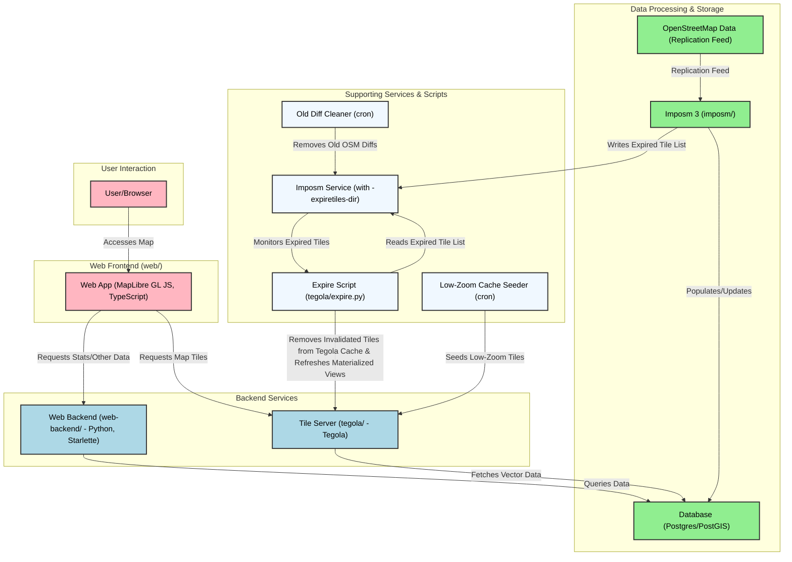

```mermaid
graph TD
    subgraph UserInteraction["User Interaction"]
        User[User/Browser]
    end

    subgraph Frontend["Web Frontend (web/)"]
        WebApp["Web App (MapLibre GL JS, TypeScript)"]
    end

    subgraph BackendServices["Backend Services"]
        WebBackend["Web Backend (web-backend/ - Python, Starlette)"]
        TileServer["Tile Server (tegola/ - Tegola)"]
    end

    subgraph DataProcessing["Data Processing & Storage"]
        Database["Database (Postgres/PostGIS)"]
        Imposm["Imposm 3 (imposm/)"]
        OSM["OpenStreetMap Data (Replication Feed)"]
    end

    subgraph SupportingServices["Supporting Services & Scripts"]
        ExpireScript["Expire Script (tegola/expire.py)"]
        CacheSeeder["Low-Zoom Cache Seeder (cron)"]
        DiffCleaner["Old Diff Cleaner (cron)"]
        ImposmService["Imposm Service (with -expiretiles-dir)"]
    end

    User -- "Accesses Map" --> WebApp
    WebApp -- "Requests Map Tiles" --> TileServer
    WebApp -- "Requests Stats/Other Data" --> WebBackend
    WebBackend -- "Queries Data" --> Database

    TileServer -- "Fetches Vector Data" --> Database

    OSM -- "Replication Feed" --> Imposm
    Imposm -- "Populates/Updates" --> Database
    Imposm -- "Writes Expired Tile List" --> ImposmService
    ImposmService -- "Monitors Expired Tiles" --> ExpireScript

    ExpireScript -- "Removes Invalidated Tiles from Tegola Cache & Refreshes Materialized Views" --> TileServer
    ExpireScript -- "Reads Expired Tile List" --> ImposmService
    CacheSeeder -- "Seeds Low-Zoom Tiles" --> TileServer
    DiffCleaner -- "Removes Old OSM Diffs" --> ImposmService


    %% Styling
    classDef frontendStyle fill:#FFB6C1,stroke:#333,stroke-width:2px,color:black;
    classDef backendStyle fill:#ADD8E6,stroke:#333,stroke-width:2px,color:black;
    classDef dataStyle fill:#90EE90,stroke:#333,stroke-width:2px,color:black;
    classDef serviceStyle fill:#F0F8FF,stroke:#333,stroke-width:2px,color:black;

    class WebApp,User frontendStyle;
    class WebBackend,TileServer backendStyle;
    class Database,Imposm,OSM dataStyle;
    class ExpireScript,CacheSeeder,DiffCleaner,ImposmService serviceStyle;
```
